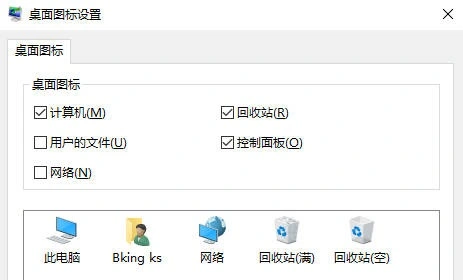
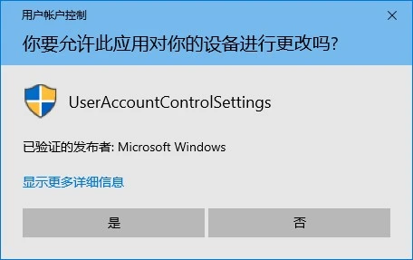
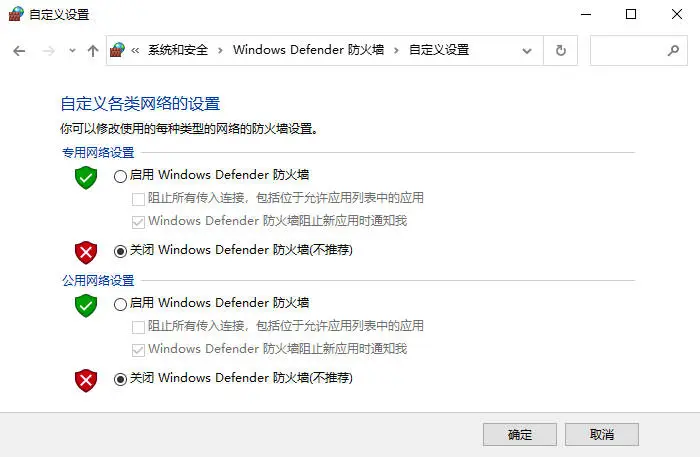
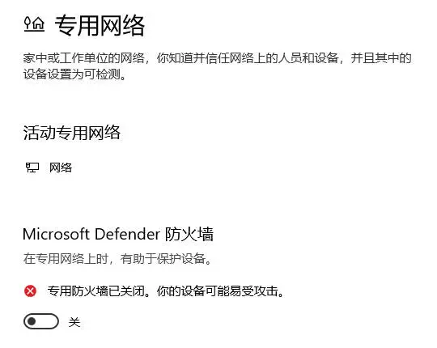
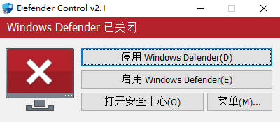

# 设置

## 任务栏内容

- 右键任务栏区域
  - 搜索 > 隐藏
  - 取消 显示“任务栏视图”按钮
  - 取消 在任务栏上显示人脉
- 右键任务栏图标，按需选择“从任务栏取消固定”
- 常用软件固定到任务栏
  - Microsoft Edge
  - 文件资源管理器

## 桌面图标设置

<a href="ms-settings:themes">打开个性化设置</a>

可通过**手动打开**方式或**快速打开**方式以打开**桌面图标设置**

- **手动打开**

  1. 打开**设置** > **个性化** > **主题**
  2. 在 **主题** > **相关设置**下，选择 **桌面图标设置**
  3. 选择你希望显示在桌面上的图标，然后选择“应用”和“确定”

  

- **快速打开**

  1. `Win` + `R` 打开**运行** （或右键**开始**按钮，选择**运行**）
  2. 运行以下命令可快速打开“桌面图标设置”

  ```cmd
  C:\Windows\system32\rundll32.exe shell32.dll,Control_RunDLL desk.cpl,,0
  ```

## 关闭用户账户控制通知

1. 打开**控制面板**（可通过`Win` + `R` 打开**运行**，输入`control`打开“控制面板”）
2. 查看方式选择**类别**
3. 点击**系统和安全** > **安全和维护** > **更改用户账户控制设置**
4. 将滑块拉到最底下的**从不通知**，并点击“确定”
5. 在弹出的“你要允许此应用对你的设备进行更改吗？”点击“是”
   

## 关闭 Windows Defender 防火墙

1. 打开**控制面板**（可通过`Win` + `R` 打开**运行**，输入`control`打开“控制面板”）
2. 查看方式选择**类别**
3. 点击**系统和安全** > **Windows Defender 防火墙**，在左侧找到**启用或关闭 Windows Defender 防火墙**
4. 两个都勾选“关闭 Windows Defender 防火墙”，然后选择“确定”
   

## 关闭 Microsoft Defender 防火墙

<a href="ms-settings:windowsdefender">打开 Windows 安全中心设置</a>

1. 打开**设置** > **更新和安全** > **Windows 安全中心** > **防火墙和网络保护**
2. 依次进入**域网络**、**专用网络**、**公用网络**页面关闭**Microsoft Defender 防火墙**
   

## 关闭 Windows 安全中心

<a href="ms-settings:windowsdefender">打开 Windows 安全中心设置</a>

1. 打开**设置** > **更新和安全** > **Windows 安全中心** > **病毒和威胁防护**
2. 点击“**病毒和威胁防护**”**设置** > **管理设置**
3. 关闭**实时保护**、**云提供的保护**、**自动提交样本**和**纂改防护**
4. 使用工具永久关闭安全中心，以下工具任选一个使用

   - [**Defender Control (dfControl)**](https://www.sordum.org/9480/defender-control-v2-1/)

     - [官网下载](https://www.sordum.org/files/downloads.php?st-defender-control)
     - [从 系统之家 下载](https://www.xitongzhijia.net/soft/243200.html)
     - [从 爱纯净下载站 下载](http://www.aichunjing.com/soft/2019-09-08/786.html)

   下载完成后解压，运行**dfControl.exe**，点击**停用 Windows Defender**
   

   - [**Defender Control**](https://github.com/qtkite/defender-control)

     - [从 GitHub 下载](https://github.com/qtkite/defender-control/releases)

   下载后双击运行即可禁用 Defender 或启用 Defender

   - `disable-defender.exe`(禁用 Defender)
   - `enable-defender.exe`(启用 Defender)

## 关闭操作中心通知

1. 右键托盘**通知图标**
2. 选择**专注助手** > **仅闹钟**
